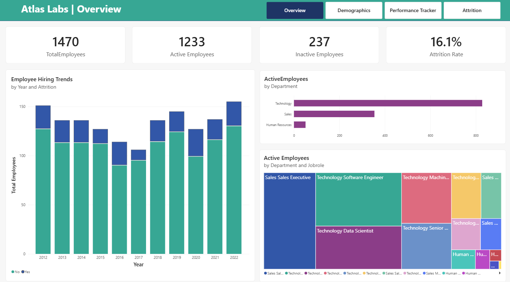
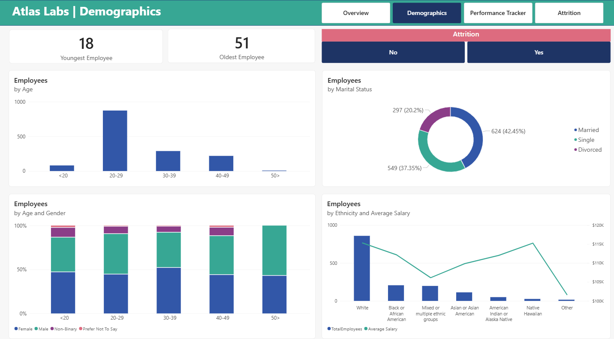
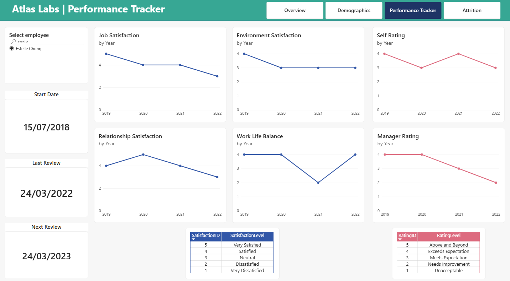
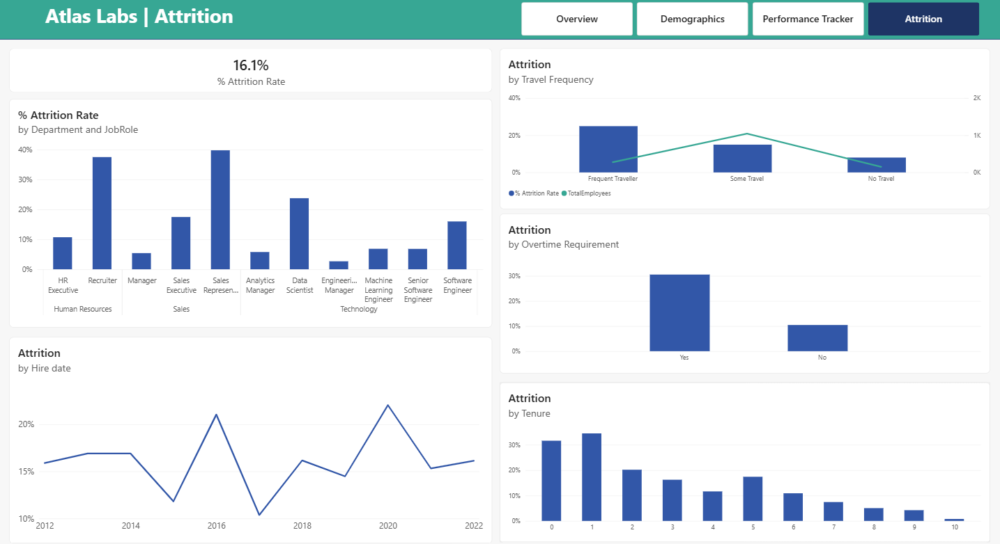

# atlas-labs-employee-attrition-analysis

## Overview
This Power BI project analyzes employee attrition for **Atlas Labs**, a fictional tech company dataset provided by DataCamp. The dashboard explores workforce demographics, hiring trends, employee satisfaction, performance ratings, overtime, business travel, and attrition patterns to uncover insights related to employee retention.

The analysis includes both active and inactive employees and uses interactive visualizations to support HR decision-making.

> **Note:** This dataset is fictional and created for educational and portfolio purposes by DataCamp. It does not represent real customer data.

---

## 📋 Table of Contents
- [Folder Structure](#-folder-structure)
- [Dataset Description](#-dataset-description)
- [Project Objectives](#-project-objectives)
- [Tools & Technologies Used](#-tools--technologies-used)
- [Data Transformation](#data-transformation)
- [DAX Measures](#dax-measures)
- [Dashboard Pages](#dashboard-pages)
- [Key Findings & Recommendations](#-key-findings--recommendations)
- [How to Open the Dashboard](#️-how-to-open-the-dashboard)
- [Author](#-author)

---

## 📁 Folder Structure

```text
atlas-labs-employee-attrition-analysis/
│
├── data/
│   └── EducationLevel.csv
│   └── Employee.csv
│   └── PerformanceRating.csv
│   └── RatingLevel.csv
│   └── SatisfiedLevel.csv
│
├── dashboard/
│   └── atlas_labs_hr_analytics_dashboard.pbix
│   └── atlas_labs_hr_analytics_dashboard.pdf
│
├── screenshots/
│   ├── page1_overview.png
│   ├── page2_demographics.png
│   ├── page3_performance_tracker.png
│   ├── page4_attrition.png
│
└── README.md
```

---

## 📊 Dataset Description

The dataset represents a fictional tech company and includes information such as:

- Fact Table: PerformanceRating (contains information about employee yearly reviews and helps Atlas Labs manage employee performance on a regular basis)
- Dimension Table: Employee
- Dimension Table: EducationLevel
- Dimension Table: RatingLevel
- Dimension Table: SatisfiedLevel
- Dimension Table: Date (created in Power BI using DAX)

---

## 🎯 Project Objectives

- Provide the leadership team at Atlas Labs with visibility into high-level employee metrics
- Understand factors impacting employee attrition
- Provide actionable recommendations to improve employee retention

---

## 🛠 Tools & Technologies Used

- **Power BI Desktop** — Data modelling & visualisation
- **Power Query Editor** — Data validation & transformation
- **DAX** — Measure and column calculations

---

## Data Transformation

The dataset was imported from pre-cleaned CSV files. The following validation and transformation steps were performed in Power Query Editor:

### Data Validation

- Verified column data types (text, whole number, decimal, boolean)
- Changed the data type of the `ReviewDate` column in the `PerformanceRating` table from `Text` to `Date`
- Confirmed no null or missing values across all columns using the Power BI **Column Quality** feature
- Checked for duplicate rows across all tables — no duplicates found
- Confirmed numeric columns had no negative or outlier values using the Power BI **Column Profile** feature

### Custom Columns Created

| Column Name | Logic | Purpose |
|---|---|---|
| Agebins | Conditional column in Power Query: `If( [Age] < 20 ) Then "<20" Else If( [Age] < 30 ) Then "20-29" Else If ( [Age] < 40 ) Then "30-39" Else If ( [Age] < 50 ) Then "40-49" Else ( "50>" )` | Categorises employee age groups |
| FullName | `FullName = DimEmployee[FirstName] & " " & DimEmployee[LastName]` | Combines employee first and last names into a single column |

---

## DAX Measures

All measures were stored in a dedicated empty table `_Measures` to keep the data model organised.

### Total Employees
```DAX
TotalEmployees = 
	DISTINCTCOUNT( DimEmployee[EmployeeID] )
```
*Returns the total number of employees in the dataset.*

---

### TotalEmployeesDate
```DAX
TotalEmployeesDate = 
			CALCULATE(
					[TotalEmployees],
					USERELATIONSHIP(DimEmployee[HireDate],DimDate[Date])
				)
```
*Calculates total employees using the inactive relationship between employee hire date and the date dimension.*

---

### Active Employees
```DAX
ActiveEmployees = 
		CALCULATE(
				[TotalEmployees],
				DimEmployee[Attrition] = "No"
			)
```
*Calculates the number of active employees.*

---

### InactiveEmployees
```DAX
InactiveEmployees =
		CALCULATE(
				[TotalEmployees],
				DimEmployee[Attrition] = "Yes"
			)
```
*Calculates the number of inactive employees.*

---

### InactiveEmployeesDate
```DAX
InactiveEmployeesDate = 
    			CALCULATE(
					[InactiveEmployees],
					USERELATIONSHIP( DimEmployee[HireDate], DimDate[Date] )
				)
```
*Calculates inactive employees using the inactive relationship between employee hire date and the date dimension.*

---

### %Attrition Rate
```DAX
% Attrition Rate = 
		DIVIDE( [InactiveEmployees],[TotalEmployees] )
```
*Calculates the employee attrition rate by dividing inactive employees by total employees.*

---

### %Attrition Rate Date
```DAX
% Attrition Rate Date = DIVIDE ( [InactiveEmployeesDate], [TotalEmployeesDate] )
```
*Calculates the attrition rate based on employee hire date using the date relationship in the date dimension.*

---

### Average Salary
```DAX
AverageSalary = AVERAGE( DimEmployee[Salary] )
```
*Calculates the average salary of employees.*

---

### LastReviewDate
```DAX
LastReviewDate = 
		IF(
			MAX( FactPerformanceRating[ReviewDate] ) = BLANK (),
			"No Review Yet",
			MAX( FactPerformanceRating[ReviewDate] )
		)
```
*Calculates the last review date of an employee.*

---

### NextReviewDate
```DAX
NextReviewDate = 
		VAR reviewOrHire =
				IF ( MAX( FactPerformanceRating[ReviewDate] ) = BLANK (),
				MAX ( DimEmployee[HireDate] ),
				MAX( FactPerformanceRating[ReviewDate] ))
		RETURN
				reviewOrHire + 365
```
*Calculates the next review date of an employee.*

---

### JobSatisfaction
```DAX
JobSatisfaction = 
		MAX( FactPerformanceRating[JobSatisfaction] ) 
```
*Returns the job satisfaction rating for the selected employee.*

---

### EnvironmentSatisfaction
```DAX
EnvironmentSatisfaction = 
			CALCULATE(
					MAX( FactPerformanceRating[EnvironmentSatisfaction] ),
					USERELATIONSHIP( FactPerformanceRating[EnvironmentSatisfaction],
							DimSatisfiedLevel[SatisfactionID])
				)
```
*Returns the environment satisfaction rating for the selected employee using the relationship between environment satisfaction and the satisfaction level dimension.*

---

### RelationshipSatisfaction
```DAX
RelationshipSatisfaction = 
			CALCULATE(
            				MAX( FactPerformanceRating[RelationshipSatisfaction] ),
            				USERELATIONSHIP( FactPerformanceRating[RelationshipSatisfaction], 											DimSatisfiedLevel[SatisfactionID])
				)
```
*Returns the relationship satisfaction rating for the selected employee using the relationship between relationship satisfaction and the satisfaction level dimension.*

---

### WorkLifeBalance
```DAX
WorkLifeBalance = 
		CALCULATE(
            			MAX( FactPerformanceRating[WorkLifeBalance] ),
            			USERELATIONSHIP( FactPerformanceRating[WorkLifeBalance], 
						DimSatisfiedLevel[SatisfactionID])
			)
```
*Returns the work-life balance rating for the selected employee using the relationship between work-life balance and the satisfaction level dimension.*

---

### SelfRating
```DAX
SelfRating = 
            MAX( FactPerformanceRating[SelfRating] )
```
*Returns the self rating for the selected employee.*

---

### ManagerRating
```DAX
ManagerRating = 
		CALCULATE( 
        			MAX( FactPerformanceRating[ManagerRating] ),
        			USERELATIONSHIP( FactPerformanceRating[ManagerRating],
						DimRatingLevel[RatingID] )
			)
```
*Returns the manager rating for the selected employee using the relationship between manager rating and the rating level dimension.*

---

## Dashboard Pages

### Page 1 — Overview
Provides a high-level summary of the overall attrition rate, total employees, and total active and inactive employees. The page includes KPI cards, charts, and a tree map visual to analyze employee hiring trends and active employees by department and job roles. Page navigation buttons are present on all report pages for seamless movement between analysis sections.



---

### Page 2 — Demographics
The Demographics page provides an overview of employee workforce composition and diversity metrics. It includes KPI cards highlighting the youngest and oldest employees in the organization. Various visualizations, such as column charts and donut charts, are used to analyze employee distribution by age, gender, marital status, and ethnicity, along with the average salary across different ethnic groups. A page-level filter for Attrition (`Yes` or `No`) with multi-select functionality allows flexible analysis of active and inactive employee segments.



---

### Page 3 — Performance Tracker
The Performance Tracker page provides detailed insights into employee performance and satisfaction metrics for an individual employee. It includes KPI cards displaying the employee’s start date, last review date, and next review date. Separate line charts are used to track job satisfaction, environment satisfaction, relationship satisfaction, and work-life balance ratings across different years. Additional line charts compare self-ratings and manager ratings over time. The page also contains informational tables explaining the meaning of each satisfaction and rating level. A single-select employee slicer is provided at the page level, ensuring all visuals and metrics display data only for the selected employee.



---

### Page 4 — Attrition
The Attrition page focuses on employee turnover analysis across the organization. It includes a KPI card displaying the overall attrition rate. Column and line charts are used to analyze attrition trends by department, job role, business travel frequency, overtime status, hire date, and employee tenure, helping identify patterns and factors contributing to workforce attrition.



---

## 📈 Key Findings & Recommendations

| # | Finding | Recommendation |
|---|---|---|
| 1 | Overall attrition rate is **16.1%** | Launch targeted retention strategies across high-risk employee segments |
| 2 | The **Sales Department** has the highest attrition rate (**20.6%**). The **Sales Representative** job role has the highest attrition rate (**39.8%**), followed by the **Recruiter** job role (**37.5%**). | Implement targeted retention strategies for the Sales department, with additional focus on the Sales Representative and Recruiter job roles |
| 3 | **Frequent Traveller** employees show the highest attrition risk with **24.9%** | Increase travel incentives or provide additional bonuses for employees who travel frequently |
| 4 | Employees with **less than 2 years of tenure** show the highest attrition risk, with employees having 1 year of tenure recording an attrition rate of **34.5%** | Provide structured onboarding, early career growth opportunities, and performance-based incentives to improve retention among newer employees |
| 5 | Employees required to work overtime have an attrition rate of **30.5%**, which is nearly three times higher than employees who are not required to work overtime (**10.4%**) | Increase overtime incentives and reduce excessive overtime requirements where possible |
| 6 | Employees hired in **2020** and **2016** showed the highest attrition rates of **22%** and **21.1%** respectively | Further analysis is required to identify factors contributing to higher attrition during these hiring years |

---

## 🖥 How to Open the Dashboard

1. Download and install [Power BI Desktop](https://powerbi.microsoft.com/desktop/) *(free)*
2. Clone or download this repository
3. Open the `dashboard/atlas_labs_hr_analytics_dashboard.pbix` file in Power BI Desktop
4. The dataset is embedded — no additional setup required
5. Navigate through report pages using the tabs at the bottom of the screen

> Built using the latest version of Power BI Desktop available at the time of development.

---

## 👤 Author

Created as part of a Power BI Data Analytics Portfolio Project.
